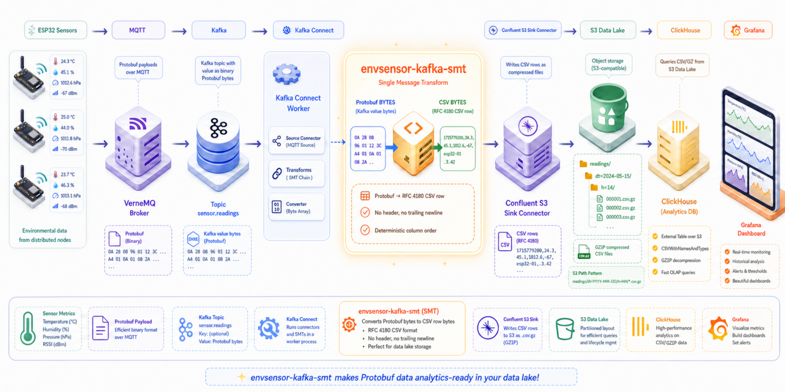

# envsensor-kafka-smt

[https://github.com/pvamos/envsensor-kafka-smt](https://github.com/pvamos/envsensor-kafka-smt)

Kafka Connect **Single Message Transform (SMT)** that decodes `envsensor.vernemq.EnrichedReading` **Protocol Buffers** from Kafka record **value BYTES** and emits a **single RFC 4180 CSV row** encoded as **UTF-8 BYTES**, **without a trailing newline**.

This project is designed to be used in a Kafka Connect pipeline where:

1. an MQTT source connector writes **raw protobuf bytes** into Kafka, where the value is `byte[]`;
2. this SMT converts protobuf bytes into **CSV row bytes**;
3. the **Confluent Amazon S3 Sink Connector** writes the transformed value bytes to S3-compatible object storage using `ByteArrayFormat`;
4. ClickHouse or another analytical system reads the generated S3 objects.

This SMT is used in a custom Kafka Connect image: [https://github.com/pvamos/kafka-connect-image](https://github.com/pvamos/kafka-connect-image)



---

## 👨‍🔬 Author

**Péter Vámos**

* [https://github.com/pvamos](https://github.com/pvamos)
* [https://linkedin.com/in/pvamos](https://linkedin.com/in/pvamos)
* [pvamos@gmail.com](mailto:pvamos@gmail.com)

---

## 🎓 Academic context

This project is part of the software stack supporting the author's **2026 thesis project**
for the **Expert in Applied Environmental Studies BSc** program at **John Wesley Theological College, Budapest**.

The SMT is used in an environmental monitoring pipeline built around ESP32 sensor nodes, VerneMQ MQTT, Kafka, Kafka Connect, S3-compatible object storage, ClickHouse and Grafana.

---

## 📜 Overview

This repository provides one Kafka Connect SMT:

```text
net.envsensor.kafka.connect.smt.EnvsensorProtobufToCsv$Value
```

It applies to the Kafka Connect **record value**.

Input:

* Kafka Connect record value must be **BYTES**:
  * `byte[]`
  * `java.nio.ByteBuffer`
* bytes must contain a serialized protobuf message:
  * `envsensor.vernemq.EnrichedReading`

Output:

* Kafka Connect record value becomes **BYTES**
* output bytes contain one UTF-8 encoded CSV row
* output schema is `Schema.BYTES_SCHEMA`
* the SMT itself emits no CSV header
* the SMT itself emits no trailing newline

The current Maven project is still named:

```text
artifactId: envsensor-smt
name: envsensor-smt
```

That means the current shaded JAR name is:

```text
target/envsensor-smt-0.1.0-all.jar
```

If you want the Maven artifact name to match the public repository name, update `pom.xml`:

```xml
<artifactId>envsensor-kafka-smt</artifactId>
<name>envsensor-kafka-smt</name>
```

After that change, the shaded JAR becomes:

```text
target/envsensor-kafka-smt-0.1.0-all.jar
```

---

## 🧭 What the SMT does

### Input

Kafka Connect record **value** must be bytes:

```text
byte[]
java.nio.ByteBuffer
```

Those bytes must contain:

```text
envsensor.vernemq.EnrichedReading
```

### Output

Kafka Connect record **value** becomes bytes:

```text
UTF-8 encoded single CSV row
```

The output schema is:

```text
Schema.BYTES_SCHEMA
```

### S3 output path in the deployment pipeline

The SMT itself does **not** write to S3. It only changes the Kafka Connect record value from enriched protobuf bytes to CSV row bytes.

In the intended deployment, the transformed Kafka record is then consumed by the **Confluent Amazon S3 Sink Connector**, which writes the record value to Amazon S3 or an S3-compatible object store.

The Confluent connector is configured to write raw byte values:

```properties
value.converter=org.apache.kafka.connect.converters.ByteArrayConverter
format.class=io.confluent.connect.s3.format.bytearray.ByteArrayFormat
storage.class=io.confluent.connect.s3.storage.S3Storage
schema.compatibility=NONE
```

For S3-compatible providers other than AWS, configure:

```properties
store.url=https://s3.example.com
```

The SMT emits UTF-8 CSV row bytes. The Confluent connector writes those bytes through `ByteArrayFormat`. By default, `ByteArrayFormat` separates records using the JDK line separator; use `format.bytearray.separator` if you need an explicit separator. The default byte-array filename extension is `.bin`; set `format.bytearray.extension=csv` if you want files to use a CSV-oriented extension.

A typical Confluent S3 Sink object layout is controlled by `topics.dir`, `partitioner.class`, `path.format`, `directory.delim`, and `file.delim`. With `TimeBasedPartitioner`, the layout is normally similar to:

```text
<topics.dir>/<topic>/<encoded-time-partition>/<topic>+<partition>+<start-offset>.<extension>[.gz]
```

Example with placeholders:

```text
readings/example-sensor-topic/dt=2026-01-05/h=13/example-sensor-topic+0+123456.csv.gz
```

### Confluent Amazon S3 Sink Connector

This deployment uses the **Amazon S3 Sink Connector for Confluent Platform**:

```text
https://docs.confluent.io/kafka-connectors/s3-sink/current/overview.html
```

The connector class is:

```text
io.confluent.connect.s3.S3SinkConnector
```

The Confluent documentation describes that the connector exports Kafka topic data to S3 objects and supports non-AWS S3-compatible object stores through the `store.url` configuration option.

The connector is distributed under the **Confluent Community License Version 1.0**:

```text
https://www.confluent.io/confluent-community-license/
```

The Confluent Community License allows access, modification and redistribution, but excludes making available a SaaS/PaaS/IaaS or similar online service that competes with Confluent products or services that provide the licensed software. It is **source-available**, not OSI-approved open source.

### What is downloaded when building the Kafka Connect image

The example multi-stage Kafka Connect image build downloads or builds these parts:

| Image layer/component | Source | Installed into image |
|---|---|---|
| Strimzi Kafka Connect base image | `quay.io/strimzi/kafka:0.49.1-kafka-4.1.1` | base image; includes Kafka and Kafka Connect runtime |
| This SMT project | `https://github.com/pvamos/envsensor-kafka-smt.git` | built with Maven, copied to `/opt/kafka/plugins/envsensor-smt/envsensor-smt.jar` in the current Dockerfile |
| Stream Reactor MQTT connector | Lenses.io Stream Reactor release archive | `/opt/kafka/plugins/mqtt` |
| Confluent Amazon S3 Sink Connector | Confluent Hub download archive `confluentinc-kafka-connect-s3` | `/opt/kafka/plugins/confluentinc-kafka-connect-s3-<version>` |

The resulting Kafka Connect image therefore contains:

* Kafka Connect runtime from the Strimzi base image
* Stream Reactor MQTT source connector
* Confluent Amazon S3 Sink Connector
* this `envsensor-kafka-smt` plugin
* required connector dependency JARs unpacked under their plugin directories

The image does **not** need to contain deployment secrets. Registry credentials, S3 access keys, MQTT passwords and connector configuration should be provided through Kubernetes Secrets, environment variables, Strimzi `KafkaConnect`/`KafkaConnector` resources, or private Helm values.

### Error handling modes

Config key:

```text
on.error
```

Supported values:

| Mode | Behavior |
|---|---|
| `fail` | default; throw a `DataException`; the task fails/restarts according to Kafka Connect worker behavior |
| `drop` | return `null`; the record is dropped |
| `pass` | return the original record unchanged |

### CSV contract

The SMT emits **one row per Kafka record**. **No header** is emitted.

Column order:

| # | Column |
|---:|---|
| 1 | `time_ns` |
| 2 | `topic` |
| 3 | `ipv4` |
| 4 | `ipv6` |
| 5 | `user` |
| 6 | `clientid` |
| 7 | `broker` |
| 8 | `mac` |
| 9 | `rssi` |
| 10 | `batt` |
| 11 | `esp32_t` |
| 12 | `bme280_t` |
| 13 | `bme280_p` |
| 14 | `bme280_h` |
| 15 | `sht4x_t` |
| 16 | `sht4x_h` |
| 17 | `kafka_topic` |
| 18 | `kafka_partition` |
| 19 | `kafka_offset` |
| 20 | `kafka_timestamp_ms` |
| 21 | `kafka_key` |
| 22 | `ingested_at_ms` |

Field notes:

* `ipv4` is rendered as a dotted decimal string, for example `192.0.2.10`; empty if missing or not exactly 4 bytes.
* `ipv6` is rendered as a text IPv6 string, for example `2001:db8::1`; empty if missing or not exactly 16 bytes.
* `mac` is rendered as a 12-character lowercase 48-bit hex value, for example `112233445566`.
* optional proto fields are rendered as empty CSV fields when absent.
* string fields are RFC 4180 escaped; quotes inside quoted fields are doubled.
* newlines in string fields can be sanitized to the literal sequence `\n`; this is enabled by default.
* `kafka_offset` is populated only for `SinkRecord`.
* `kafka_timestamp_ms` is the Kafka record timestamp in milliseconds since epoch; empty if missing.
* `kafka_key` is stringified; bytes keys are represented as `bytes(N)`.
* `ingested_at_ms` is wall-clock milliseconds since epoch at SMT `apply()` time.

---

## 🧬 Input protobuf schema

Current schema:

```proto
syntax = "proto3";

package envsensor.vernemq;

option java_package = "envsensor.vernemq";
option java_multiple_files = true;

message EnrichedReading {
  uint64 time = 1;
  string topic = 2;
  bytes ipv4 = 3;
  bytes ipv6 = 4;
  string user = 5;
  string clientid = 6;
  string broker = 7;

  fixed64 mac = 8;

  sint32 rssi    = 9;
  uint32 batt    = 10;
  float  esp32_t = 11;

  optional float bme280_t = 12;
  optional float bme280_p = 13;
  optional float bme280_h = 14;

  optional float sht4x_t  = 15;
  optional float sht4x_h  = 16;
}
```

---

## ⚙️ Configuration

SMT config keys:

| Key | Type | Default | Meaning |
|---|---|---:|---|
| `on.error` | string | `fail` | `fail`, `drop`, or `pass` |
| `csv.delimiter` | string | `,` | single-character delimiter |
| `csv.sanitize.newlines` | boolean | `true` | replace CR/LF with literal `\n` in string fields |
| `require.bytes` | boolean | `true` | if true, non-bytes values throw; if false, non-bytes values pass through |

Example connector config snippet:

```properties
transforms=EncodeCsv
transforms.EncodeCsv.type=net.envsensor.kafka.connect.smt.EnvsensorProtobufToCsv$Value
transforms.EncodeCsv.on.error=fail
transforms.EncodeCsv.csv.delimiter=,
transforms.EncodeCsv.csv.sanitize.newlines=true
transforms.EncodeCsv.require.bytes=true
```

---

## 🧱 Repository layout

```text
.
├── pom.xml
├── README.md
├── LICENSE
├── THIRD_PARTY_NOTICES.md
└── src
    ├── main
    │   ├── java/net/envsensor/kafka/connect/smt
    │   │   ├── EnvsensorProtobufToCsv.java
    │   │   └── TransformConfig.java
    │   ├── proto/enriched_reading.proto
    │   └── resources/META-INF/services/org.apache.kafka.connect.transforms.Transformation
    └── test/java/net/envsensor/kafka/connect/smt/EnvsensorProtobufToCsvTest.java
```

### Key files

| File | Purpose |
|---|---|
| `src/main/proto/enriched_reading.proto` | defines the `EnrichedReading` message |
| `EnvsensorProtobufToCsv.java` | main SMT implementation; parses protobuf bytes, formats CSV, returns bytes |
| `TransformConfig.java` | shared config parsing for `on.error` |
| `META-INF/services/org.apache.kafka.connect.transforms.Transformation` | Java ServiceLoader registration for Kafka Connect plugin discovery |
| `EnvsensorProtobufToCsvTest.java` | unit test that builds a protobuf message, applies the SMT, verifies bytes output and no newline |

---

## 🛠 Building the SMT JAR

### Prerequisites

* JDK 17
* Maven 3.9+
* Maven handles `protoc` through the protobuf Maven plugin

Check versions:

```bash
java -version
mvn -version
```

### Build

From the repository root:

```bash
mvn -U -DskipTests package
```

Current output artifact:

```text
target/envsensor-smt-0.1.0-all.jar
```

If you rename the Maven artifact to `envsensor-kafka-smt`, the output artifact becomes:

```text
target/envsensor-kafka-smt-0.1.0-all.jar
```

### Run tests

```bash
mvn -U test
```

### Regenerate protobuf classes

Normally handled automatically by Maven:

```bash
mvn -U compile
```

Generated Java sources are build output and should not be committed.

---

## 📦 Building a Kafka Connect image that includes the SMT

A common deployment pattern is a custom Kafka Connect image based on a Strimzi image, with connector plugins and this SMT installed under `/opt/kafka/plugins`.

### Public-safe Dockerfile example

```Dockerfile
# syntax=docker/dockerfile:1.6

FROM docker.io/library/maven:3.9.12-eclipse-temurin-17 AS smt-build

ARG SMT_REPO="https://github.com/pvamos/envsensor-kafka-smt.git"
ARG SMT_REF="main"
ARG SMT_SUBDIR="."
ARG SMT_MVN_ARGS="-DskipTests package"
ARG SMT_JAR_GLOB="target/*-all.jar"
ARG SMT_CACHEBUST=0

WORKDIR /work

RUN set -eux;     apt-get update;     apt-get install -y --no-install-recommends git ca-certificates;     rm -rf /var/lib/apt/lists/*

RUN --mount=type=secret,id=github_token,required=false     set -eu;     echo "SMT_CACHEBUST=${SMT_CACHEBUST}";     mkdir -p repo;     if [ -f /run/secrets/github_token ]; then       token="$(cat /run/secrets/github_token)";       git clone --depth 1 --branch "${SMT_REF}" "https://${token}@${SMT_REPO#https://}" repo;     else       git clone --depth 1 --branch "${SMT_REF}" "${SMT_REPO}" repo;     fi

WORKDIR /work/repo/${SMT_SUBDIR}

RUN set -eux;     mvn -U ${SMT_MVN_ARGS};     test -n "$(ls -1 ${SMT_JAR_GLOB} 2>/dev/null | head -n1)"

RUN set -eux;     JAR="$(ls -1 ${SMT_JAR_GLOB} | head -n1)";     cp -v "${JAR}" /work/envsensor-smt.jar

FROM quay.io/strimzi/kafka:0.49.1-kafka-4.1.1

USER root:root

RUN mkdir -p /opt/kafka/plugins

RUN set -eux;     microdnf update -y;     microdnf install -y unzip tar;     microdnf clean all

# Stream Reactor MQTT Source
RUN mkdir -p /opt/kafka/plugins/mqtt

ARG STREAM_REACTOR_VERSION=11.3.0
ARG MQTT_ARTIFACT="kafka-connect-mqtt-${STREAM_REACTOR_VERSION}.zip"

RUN set -eux;     curl -fsSL -o "/tmp/${MQTT_ARTIFACT}"       "https://github.com/lensesio/stream-reactor/releases/download/${STREAM_REACTOR_VERSION}/${MQTT_ARTIFACT}";     unzip "/tmp/${MQTT_ARTIFACT}" -d /opt/kafka/plugins/mqtt;     rm -f "/tmp/${MQTT_ARTIFACT}"

# Confluent Amazon S3 Sink Connector
ARG CONFLUENT_S3_VERSION=12.0.0
ARG CONFLUENT_S3_ZIP="confluentinc-kafka-connect-s3-${CONFLUENT_S3_VERSION}.zip"
ARG CONFLUENT_S3_URL="https://hub-downloads.confluent.io/api/plugins/confluentinc/kafka-connect-s3/versions/${CONFLUENT_S3_VERSION}/${CONFLUENT_S3_ZIP}"

RUN set -eux;     curl -fsSL -o "/tmp/${CONFLUENT_S3_ZIP}" "${CONFLUENT_S3_URL}";     unzip -q "/tmp/${CONFLUENT_S3_ZIP}" -d /opt/kafka/plugins;     rm -f "/tmp/${CONFLUENT_S3_ZIP}";     test -d "/opt/kafka/plugins/confluentinc-kafka-connect-s3-${CONFLUENT_S3_VERSION}/lib"

# envsensor SMT plugin
RUN mkdir -p /opt/kafka/plugins/envsensor-smt

COPY --from=smt-build /work/envsensor-smt.jar /opt/kafka/plugins/envsensor-smt/envsensor-smt.jar

RUN set -eux;     chown -R 1001:0 /opt/kafka/plugins;     chmod -R g+rx /opt/kafka/plugins

USER 1001
```

### Podman build example

```bash
podman build   --format docker   --build-arg SMT_CACHEBUST="$(date +%s)"   --secret id=github_token,src=~/.github_token   --build-arg SMT_REPO="https://github.com/pvamos/envsensor-kafka-smt.git"   --build-arg SMT_REF="main"   -t registry.example.com/example/kafka-connect:0.0.0   .
```

Push:

```bash
podman push registry.example.com/example/kafka-connect:0.0.0
```

Notes:

* `--secret ...` is only required if the SMT repository is private.
* Do not embed GitHub tokens in the Dockerfile, image tag, shell history or CI logs.
* `SMT_CACHEBUST` forces Podman to re-run the clone layer when needed.

---

## 🧱 Kafka Connect image contents

The deployment uses a custom Kafka Connect container image so that Kafka Connect can load all required plugins from `/opt/kafka/plugins`.

The image is built in two stages:

1. **Maven build stage**
   * clones `envsensor-kafka-smt`
   * checks out the configured branch, tag or commit
   * builds the shaded SMT JAR with Maven
   * copies the generated JAR to a stable intermediate path

2. **Kafka Connect runtime stage**
   * starts from the Strimzi Kafka image
   * installs archive tools needed to unpack connector releases
   * downloads the Stream Reactor MQTT connector
   * downloads the Confluent Amazon S3 Sink Connector ZIP from Confluent Hub
   * copies the built SMT JAR into the Kafka Connect plugin path
   * fixes ownership and permissions for the Kafka Connect runtime user

Expected plugin directories in the current Dockerfile:

```text
/opt/kafka/plugins/mqtt
/opt/kafka/plugins/confluentinc-kafka-connect-s3-12.0.0
/opt/kafka/plugins/envsensor-smt
```

Expected current SMT JAR path:

```text
/opt/kafka/plugins/envsensor-smt/envsensor-smt.jar
```

The SMT plugin is discovered through the Java ServiceLoader file inside the JAR:

```text
META-INF/services/org.apache.kafka.connect.transforms.Transformation
```

This file registers:

```text
net.envsensor.kafka.connect.smt.EnvsensorProtobufToCsv$Value
```

### Keep secrets out of the image

Do not bake the following into the image:

* S3 access keys or secret keys
* MQTT usernames or passwords
* Kafka user passwords
* registry robot tokens
* GitHub tokens
* production connector configuration
* production topic names if they reveal sites/devices/customers

Use image build secrets only for private repository cloning if needed, and pass runtime configuration separately through Kubernetes/Strimzi/Helm.

---

## 🔌 Using Kafka Connect with the SMT

This SMT is a Kafka Connect plugin. In Strimzi, plugins are normally discovered by scanning:

```text
/opt/kafka/plugins
```

Example plugin path:

```text
/opt/kafka/plugins/envsensor-kafka-smt/envsensor-kafka-smt.jar
```

### 1️⃣ Deploy KafkaConnect with the custom image

Example Helm/private values:

```yaml
connect:
  image: "registry.example.com/example/kafka-connect:0.0.0"
  replicas: 3
  version: 4.1.1
  imagePullSecrets:
    - name: example-registry-pull-secret
```

### 2️⃣ Ensure upstream connectors produce BYTES

Your MQTT source connector must write protobuf as bytes into Kafka.

Use a bytes converter:

```yaml
value.converter: "org.apache.kafka.connect.converters.ByteArrayConverter"
```

For Stream Reactor MQTT source examples, use a bytes converter and avoid JSON/base64 conversion.

### 3️⃣ Configure the S3 sink connector to apply the SMT

Representative **Confluent Amazon S3 Sink Connector** configuration with public placeholders:

```yaml
apiVersion: kafka.strimzi.io/v1beta2
kind: KafkaConnector
metadata:
  name: envsensor-s3-readings-csv-gz-sink
  labels:
    strimzi.io/cluster: example-connect
spec:
  class: io.confluent.connect.s3.S3SinkConnector
  tasksMax: 3
  config:
    topics: "example-sensor-topic"

    key.converter: "org.apache.kafka.connect.storage.StringConverter"
    value.converter: "org.apache.kafka.connect.converters.ByteArrayConverter"

    transforms: "EncodeCsv"
    transforms.EncodeCsv.type: "net.envsensor.kafka.connect.smt.EnvsensorProtobufToCsv$Value"
    transforms.EncodeCsv.on.error: "fail"
    transforms.EncodeCsv.csv.delimiter: ","
    transforms.EncodeCsv.csv.sanitize.newlines: "true"
    transforms.EncodeCsv.require.bytes: "true"

    storage.class: "io.confluent.connect.s3.storage.S3Storage"
    format.class: "io.confluent.connect.s3.format.bytearray.ByteArrayFormat"
    schema.compatibility: "NONE"

    s3.bucket.name: "example-lake"
    s3.region: "example-region"
    store.url: "https://s3.example.com"
    s3.compression.type: "gzip"

    aws.access.key.id: "${env:AWS_ACCESS_KEY_ID}"
    aws.secret.access.key: "${env:AWS_SECRET_ACCESS_KEY}"

    format.bytearray.extension: "csv"
    format.bytearray.separator: "\\n"

    partitioner.class: "io.confluent.connect.storage.partitioner.TimeBasedPartitioner"
    path.format: "'dt'=YYYY-MM-dd/'h'=HH"
    partition.duration.ms: "3600000"
    locale: "en"
    timezone: "UTC"
    timestamp.extractor: "Record"

    topics.dir: "readings"
    flush.size: "1000"
```

### 4️⃣ Verify plugin loading

```bash
kubectl -n kafka exec -it <connect-pod> --   find /opt/kafka/plugins -maxdepth 3 -type f -name '*envsensor*jar' -print
```

Also check Kafka Connect worker logs for plugin scanning messages.

---

## ☁️ S3 output produced by Kafka Connect

Kafka Connect writes records generated by the SMT into S3-compatible object storage through the Confluent Amazon S3 Sink Connector.

### Output location and naming

With the example Confluent configuration:

```properties
topics.dir=readings
partitioner.class=io.confluent.connect.storage.partitioner.TimeBasedPartitioner
path.format='dt'=YYYY-MM-dd/'h'=HH
format.bytearray.extension=csv
s3.compression.type=gzip
```

Confluent's S3 connector creates object names using its standard layout:

```text
<topics.dir>/<topic>/<encodedPartition>/<topic>+<kafkaPartition>+<startOffset>.<format>[.gz]
```

Example with placeholders:

```text
readings/example-sensor-topic/dt=2026-01-05/h=13/example-sensor-topic+0+123456.csv.gz
```

### Format and compression

Key connector settings:

```properties
value.converter=org.apache.kafka.connect.converters.ByteArrayConverter
storage.class=io.confluent.connect.s3.storage.S3Storage
format.class=io.confluent.connect.s3.format.bytearray.ByteArrayFormat
schema.compatibility=NONE
format.bytearray.extension=csv
format.bytearray.separator=\n
s3.compression.type=gzip
```

Meaning:

* the SMT emits UTF-8 CSV row bytes
* `ByteArrayConverter` keeps the transformed value as bytes
* `ByteArrayFormat` writes raw record value bytes into S3 objects
* `format.bytearray.separator=\n` separates records in each S3 object
* `format.bytearray.extension=csv` makes the pre-compression extension `.csv`
* `s3.compression.type=gzip` produces `.csv.gz` objects

The SMT itself does not append a trailing newline. The sink connector separates multiple records in the same object according to `format.bytearray.separator`.

### Row contents

Each logical row in the S3 object is the SMT output: one CSV row containing the 22 columns in the documented order, ending with `ingested_at_ms`.

---

## 🏞 Reading S3 CSV data from ClickHouse

The generated S3 objects can be queried from ClickHouse using the `s3()` table function.

### Expected file glob

For the example Confluent object layout above, a ClickHouse glob normally needs to include the Kafka topic directory:

```yaml
s3Lake:
  namedCollection: "s3_lake"
  filename: "readings/*/dt=*/h=*/*.csv.gz"
  compression_method: "gzip"
  format: "CSV"
  structure: "time_ns String, topic String, ipv4 String, ipv6 String, user String, clientid String, broker String, mac String, rssi String, batt String, esp32_t String, bme280_t String, bme280_p String, bme280_h String, sht4x_t String, sht4x_h String, kafka_topic String, kafka_partition String, kafka_offset String, kafka_timestamp_ms String, kafka_key String, ingested_at_ms String"
```

ClickHouse reads all objects matching:

```text
readings/*/dt=*/h=*/*.csv.gz
```

Adjust this pattern if you change `topics.dir`, `path.format`, the partitioner, or the byte-array extension/compression settings.

### Typed view pattern

A useful ClickHouse pattern is:

1. read all CSV columns as `String`
2. convert in an outer `SELECT`

Conceptual query:

```sql
SELECT
    fromUnixTimestamp64Nano(toInt64(time_ns), 'UTC') AS time,
    topic,
    toIPv4OrNull(nullIf(ipv4, '')) AS ipv4_addr,
    toIPv6OrNull(nullIf(ipv6, '')) AS ipv6_addr,
    user,
    clientid,
    broker,
    reinterpretAsUInt64(reverse(unhex(leftPad(mac, 16, '0')))) AS mac_uint64,
    toInt32OrNull(nullIf(rssi, '')) AS rssi,
    toUInt32OrNull(nullIf(batt, '')) AS batt,
    toFloat32OrNull(nullIf(esp32_t, '')) AS esp32_t,
    toFloat32OrNull(nullIf(bme280_t, '')) AS bme280_t,
    toFloat32OrNull(nullIf(bme280_p, '')) AS bme280_p,
    toFloat32OrNull(nullIf(bme280_h, '')) AS bme280_h,
    toFloat32OrNull(nullIf(sht4x_t, '')) AS sht4x_t,
    toFloat32OrNull(nullIf(sht4x_h, '')) AS sht4x_h,
    kafka_topic,
    toInt32OrNull(nullIf(kafka_partition, '')) AS kafka_partition,
    toInt64OrNull(nullIf(kafka_offset, '')) AS kafka_offset,
    fromUnixTimestamp64Milli(toInt64(kafka_timestamp_ms), 'UTC') AS kafka_timestamp,
    kafka_key,
    fromUnixTimestamp64Milli(toInt64(ingested_at_ms), 'UTC') AS ingested_at
FROM s3(
    s3_lake,
    filename='readings/*/dt=*/h=*/*.csv.gz',
    compression_method='gzip',
    format='CSV',
    structure='time_ns String, topic String, ipv4 String, ipv6 String, user String, clientid String, broker String, mac String, rssi String, batt String, esp32_t String, bme280_t String, bme280_p String, bme280_h String, sht4x_t String, sht4x_h String, kafka_topic String, kafka_partition String, kafka_offset String, kafka_timestamp_ms String, kafka_key String, ingested_at_ms String'
);
```

Credentials and base URL should come from ClickHouse named collections or Kubernetes Secrets, not public SQL files.

### Example queries

```sql
SELECT count()
FROM envsensor.readings_s3;
```

```sql
SELECT *
FROM envsensor.readings_s3
ORDER BY time DESC
LIMIT 10;
```

```sql
SELECT time, topic, bme280_t, bme280_h, sht4x_t, sht4x_h
FROM envsensor.readings_s3
WHERE topic = 'envsensor/example-site/example-device'
  AND time >= now() - INTERVAL 1 DAY
ORDER BY time DESC;
```

### Relationship to main DB tables

A deployment can use two parallel paths:

1. **Kafka Engine ingest → MergeTree**
   * `envsensor.readings_kafka`
   * `envsensor.readings_mv`
   * `envsensor.readings`

2. **S3 lake direct query**
   * `envsensor.readings_s3`

Operationally:

* use `envsensor.readings` for low-latency, indexed queries on ingested data
* use `envsensor.readings_s3` for validating the lake, backfills, audits or querying historical partitions directly from S3

---

## 🧰 Replace placeholders before use

Before using this repository in a real Kafka Connect deployment, replace placeholder values with private deployment values.

There are two supported workflows.

---

### 1️⃣ Edit placeholder files directly in a private clone

Use this workflow if you cloned the repository for your own deployment and do **not** plan to push your modified examples or deployment snippets back to a public remote.

#### Step 1: build the plugin

```bash
mvn -U clean package
```

#### Step 2: choose your real Kafka Connect image reference

Replace:

```text
registry.example.com/example/kafka-connect:0.0.0
```

with your real registry and image tag:

```text
<your-registry>/<your-project>/kafka-connect:<your-tag>
```

Build and push:

```bash
podman build   -t <your-registry>/<your-project>/kafka-connect:<your-tag>   .

podman push <your-registry>/<your-project>/kafka-connect:<your-tag>
```

#### Step 3: set real Kubernetes image pull secret names

Replace:

```yaml
imagePullSecrets:
  - name: example-registry-pull-secret
```

with your real secret:

```yaml
imagePullSecrets:
  - name: <your-image-pull-secret>
```

Create it in the Kafka Connect namespace if required:

```bash
kubectl -n kafka create secret docker-registry <your-image-pull-secret>   --docker-server=<your-registry>   --docker-username=<your-registry-username>   --docker-password=<your-registry-token>   --docker-email=<your-email>
```

#### Step 4: set real connector values

Replace:

```yaml
topics: "example-sensor-topic"
aws.s3.bucket.name: "example-lake"
aws.s3.endpoint: "https://s3.example.com"
aws.s3.region: "example-region"
```

with real values:

```yaml
topics: "<your-kafka-topic>"
aws.s3.bucket.name: "<your-s3-bucket>"
aws.s3.endpoint: "<your-s3-endpoint>"
aws.s3.region: "<your-s3-region>"
```

Keep credentials out of plain YAML when possible:

```yaml
aws.access.key.id: "${env:AWS_ACCESS_KEY_ID}"
aws.secret.access.key: "${env:AWS_SECRET_ACCESS_KEY}"
```

#### Step 5: provide object-storage credentials securely

Create a Kubernetes Secret or use your platform's secret manager.

Example Kubernetes Secret:

```bash
kubectl -n kafka create secret generic s3-credentials   --from-literal=AWS_ACCESS_KEY_ID='<your-access-key-id>'   --from-literal=AWS_SECRET_ACCESS_KEY='<your-secret-access-key>'
```

Expose it in the Kafka Connect pod as environment variables through your Strimzi `KafkaConnect` resource or Helm chart.

#### Step 6: deploy the connector

Apply your private connector manifest or Helm values:

```bash
kubectl apply -f <your-private-kafkaconnector.yaml>
```

Verify status:

```bash
kubectl -n kafka get kafkaconnector
kubectl -n kafka describe kafkaconnector <your-connector-name>
```

---

### 2️⃣ Keep public files unchanged and use private deployment files

Use this workflow if you want to keep the Git checkout clean and avoid accidentally committing deployment-specific values.

Recommended layout:

```text
projects/
├── envsensor-kafka-smt/              # public Git repository
└── private-envsensor-kafka-smt/      # not committed
    ├── kafka-connect-image.env
    ├── kafkaconnector.private.yaml
    └── values.private.yaml
```

#### Step 1: create a private build environment file

Create:

```text
../private-envsensor-kafka-smt/kafka-connect-image.env
```

Example:

```bash
export CONNECT_IMAGE='<your-registry>/<your-project>/kafka-connect:<your-tag>'
export REGISTRY_SERVER='<your-registry>'
export REGISTRY_USERNAME='<your-registry-username>'
export REGISTRY_TOKEN='<your-registry-token>'
export IMAGE_PULL_SECRET='<your-image-pull-secret>'
```

Use it:

```bash
set -a
. ../private-envsensor-kafka-smt/kafka-connect-image.env
set +a
```

#### Step 2: create a private connector manifest

Create:

```text
../private-envsensor-kafka-smt/kafkaconnector.private.yaml
```

Example:

```yaml
apiVersion: kafka.strimzi.io/v1
kind: KafkaConnector
metadata:
  name: <your-s3-sink-connector-name>
  namespace: kafka
  labels:
    strimzi.io/cluster: <your-kafka-connect-cluster-name>
spec:
  class: io.confluent.connect.s3.S3SinkConnector
  tasksMax: 3
  config:
    topics: "<your-kafka-topic>"

    key.converter: "org.apache.kafka.connect.storage.StringConverter"
    value.converter: "org.apache.kafka.connect.converters.ByteArrayConverter"

    transforms: "EncodeCsv"
    transforms.EncodeCsv.type: "net.envsensor.kafka.connect.smt.EnvsensorProtobufToCsv$Value"
    transforms.EncodeCsv.on.error: "fail"
    transforms.EncodeCsv.csv.delimiter: ","
    transforms.EncodeCsv.csv.sanitize.newlines: "true"
    transforms.EncodeCsv.require.bytes: "true"

    storage.class: "io.confluent.connect.s3.storage.S3Storage"
    format.class: "io.confluent.connect.s3.format.bytearray.ByteArrayFormat"
    schema.compatibility: "NONE"

    s3.bucket.name: "<your-s3-bucket>"
    s3.region: "<your-s3-region>"
    store.url: "<your-s3-endpoint>"
    aws.access.key.id: "${env:AWS_ACCESS_KEY_ID}"
    aws.secret.access.key: "${env:AWS_SECRET_ACCESS_KEY}"

    format.bytearray.extension: "csv"
    format.bytearray.separator: "\n"
    s3.compression.type: "gzip"

    partitioner.class: "io.confluent.connect.storage.partitioner.TimeBasedPartitioner"
    path.format: "'dt'=YYYY-MM-dd/'h'=HH"
    partition.duration.ms: "3600000"
    locale: "en"
    timezone: "UTC"
    timestamp.extractor: "Record"
    topics.dir: "readings"
```

#### Step 3: apply private manifests

```bash
kubectl apply -f ../private-envsensor-kafka-smt/kafkaconnector.private.yaml
```

#### Step 4: keep private files ignored

Recommended local ignore patterns:

```gitignore
private/
secrets/
*.private.yaml
*.private.yml
*.local.yaml
*.local.yml
.env
.env.*
*_token
*token*
*.kubeconfig
```

Before committing changes to the public repo:

```bash
git status
git diff --cached
```

---

## 🧪 Testing with synthetic data

Unit tests build a synthetic protobuf message and verify that the SMT emits bytes containing a CSV row.

Run:

```bash
mvn -U test
```

For manual integration testing, avoid using production payloads. Generate synthetic protobuf payloads with fake values:

* topic: `envsensor/example-site/example-device`
* user: `example-device-user`
* client ID: `example-client`
* broker: `broker.example`
* IPv4: `192.0.2.10`
* IPv6: `2001:db8::10`
* MAC: `112233445566`

---

## ⚠️ Operational cautions

* This SMT changes the Kafka Connect record value from protobuf bytes to CSV bytes.
* Downstream connectors must expect the transformed value to be bytes.
* The SMT does not emit a CSV header.
* If you change the column order, update downstream ClickHouse/S3 readers.
* `on.error=drop` can silently discard records.
* `on.error=pass` can mix protobuf and CSV bytes in the same sink if downstream is not prepared for it.
* MQTT topic, user, client ID, broker, MAC, IP and RSSI are copied into the CSV row, so generated output is operational data and may be sensitive.
* CSV output files should be protected at the bucket, prefix and IAM/policy level.

---

## 🔬 Troubleshooting

### Kafka Connect cannot find the transform class

Check the plugin JAR path inside the Connect pod:

```bash
kubectl -n kafka exec -it <connect-pod> --   find /opt/kafka/plugins -maxdepth 3 -type f -name '*envsensor*jar' -print
```

Verify the service registration file exists inside the JAR:

```bash
jar tf target/envsensor-smt-0.1.0-all.jar | grep 'META-INF/services/org.apache.kafka.connect.transforms.Transformation'
```

Expected class name:

```text
net.envsensor.kafka.connect.smt.EnvsensorProtobufToCsv$Value
```

Restart Kafka Connect after changing plugins.

### Records fail with "Record value must be BYTES"

The upstream connector is not writing bytes.

Use a byte array converter:

```yaml
value.converter: "org.apache.kafka.connect.converters.ByteArrayConverter"
```

For Stream Reactor MQTT source examples, make sure the KCQL and converter settings keep payloads as raw bytes.

### Protobuf parsing fails

The bytes are not an `envsensor.vernemq.EnrichedReading` message.

Check:

* upstream VerneMQ enrichment plugin output schema
* Kafka topic being read by the sink
* connector converter configuration
* whether the payload is JSON, base64 or another protobuf message

### S3 files do not contain readable CSV rows

The Confluent S3 Sink must use `ByteArrayConverter` and `ByteArrayFormat` so the SMT output bytes are written as raw values.

Use:

```yaml
value.converter: "org.apache.kafka.connect.converters.ByteArrayConverter"
format.class: "io.confluent.connect.s3.format.bytearray.ByteArrayFormat"
storage.class: "io.confluent.connect.s3.storage.S3Storage"
schema.compatibility: "NONE"
format.bytearray.extension: "csv"
```

### ClickHouse cannot read the generated files

Check:

* S3 file path and prefix
* compression type matches the connector setting, for example `gzip`
* format is `CSV`
* column order matches this README
* empty fields are handled as nullable values in the ClickHouse query
* credentials are available through named collections, environment variables or Kubernetes Secrets

---

## 🧭 Roadmap / recommended improvements

* Rename Maven `artifactId` and `name` from `envsensor-smt` to `envsensor-kafka-smt`, if you want artifact names to match the public repo.
* Add a public synthetic protobuf sample generator.
* Add integration tests with a real Kafka Connect test harness.
* Add a `Key` transform variant if key transformation becomes useful.
* Make `ingested_at_ms` optionally disabled or record-time based.
* Optionally support a header row generator as a separate utility.
* Add Maven Enforcer rules for Java version and dependency convergence.
* Align Maven project version and SMT `version()` return value.
* Add CI for Maven build and tests.
* Add example `KafkaConnector` manifests under `examples/`.

---

## ⚖️ License

This project is published under the **MIT License**.

This repository imports Kafka Connect APIs, uses protobuf-generated classes from this repository's own `.proto` file, and shades `protobuf-java` into the plugin JAR.

### Third-party dependency notes

The third-party runtime/build dependency notices are in `THIRD_PARTY_NOTICES.md`.

---

| Dependency / tool | How it is used | Practical licensing note |
|---|---|---|
| Apache Kafka Connect API | `connect-api` and `connect-transforms` are Maven dependencies with `provided` scope | not included in the shaded plugin JAR; the Kafka Connect runtime supplies them |
| `protobuf-java` | runtime dependency shaded into the plugin JAR | include the protobuf license/notice when distributing the shaded JAR |
| generated Java code from `enriched_reading.proto` | generated from this repository's own schema | owned by the owner of the input `.proto`; requires the protobuf support library |
| Maven plugins and test dependencies | build/test time only | normally not shipped in the runtime plugin JAR |
| Confluent Amazon S3 Sink Connector | not included in repo, the intended deployment uses it | included in the built image, not the JAR |

If you distribute a complete Kafka Connect container image that also contains Strimzi, Stream Reactor, Confluent Amazon S3 Sink Connector or other plugins, that image has additional third-party licensing obligations beyond this SMT repository. Include the relevant licenses/notices in the image or accompanying documentation.

### MIT License

The **MIT License** is in `LICENSE`.

---

MIT License

Copyright (c) 2025 Péter Vámos pvamos@gmail.com https://github.com/pvamos

Permission is hereby granted, free of charge, to any person obtaining a copy
of this software and associated documentation files (the "Software"), to deal
in the Software without restriction, including without limitation the rights
to use, copy, modify, merge, publish, distribute, sublicense, and/or sell
copies of the Software, and to permit persons to whom the Software is
furnished to do so, subject to the following conditions:

The above copyright notice and this permission notice shall be included in all
copies or substantial portions of the Software.

THE SOFTWARE IS PROVIDED "AS IS", WITHOUT WARRANTY OF ANY KIND, EXPRESS OR
IMPLIED, INCLUDING BUT NOT LIMITED TO THE WARRANTIES OF MERCHANTABILITY,
FITNESS FOR A PARTICULAR PURPOSE AND NONINFRINGEMENT. IN NO EVENT SHALL THE
AUTHORS OR COPYRIGHT HOLDERS BE LIABLE FOR ANY CLAIM, DAMAGES OR OTHER
LIABILITY, WHETHER IN AN ACTION OF CONTRACT, TORT OR OTHERWISE, ARISING FROM,
OUT OF OR IN CONNECTION WITH THE SOFTWARE OR THE USE OR OTHER DEALINGS IN THE
SOFTWARE.
